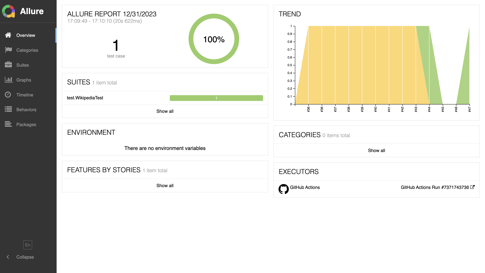

# Automation Project Selenium

Automation project with Java + Gradle and GitHub Action (CI) doing the remote web test, GithubPages to deploy Allure
Serve to see test results, PageObject and PageFactory structure.

[](https://github.com/tassioplima/Selenium/actions)
[](https://tassioplima.github.io/Selenium/)

Configuration:

- Java JDK +17

Running test:

``` bash
./gradlew test --tests "MercedesTest"
```

Running with different web drivers:

``` bash
./gradlew test --tests "WikipediaTest" -DBROWSER=chrome
```

``` bash
./gradlew test --tests "WikipediaTest" -DBROWSER=firefox
```

Running headless:

``` bash
./gradlew test --tests "WikipediaTest" -DBROWSER=chrome -DHEADLESS=true
```

### Building Allure report

To build a report, and browse it use the following command:

``` bash
./gradlew allureServe
```

Github Pages with Allure report results: [ALLURE](https://tassioplima.github.io/Selenium/)


